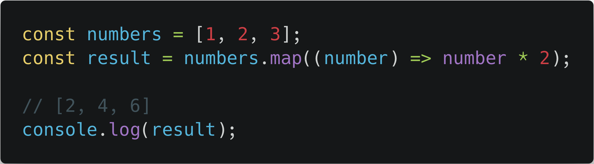

<!-- .slide: data-background="./images/coding_garden.png"  -->

---

### `Array.prototype.map`

---

### `Array.prototype.map`

* What is `map`?
* When should you use a `map`?
* See some Examples

---

# What is `map`?

---

`map` is a higher order function on the `Array` prototype.

This means we can call `.map()` on _any_ array we create.

---

From MDN:

>The map() method creates a new array with the results of calling a provided function on every element in the calling array.

---

---

## ...**new array**...
## ...**calling a provided function on every element in the calling array**...

---

### We will provide the function double:

---

---

#### We could call it manually for every element in the array:

---

#### We could also use a for loop to call the function for every element in the array:

---

#### We could also use a forEach to call the function for every element in the array:

---

## This is where `map` comes into play! Instead of calling the function manually, we can pass the function to `map` and JavaScript will call the function on every element for us!

---

#### We pass the function into `.map()` and it is called on every element of the array for us!:

---

#### We can also define the function _inline_. It works the same way:

---

---

## What is `map`?

>The map() method creates a **new array** with the results of **calling a provided function on every element in the calling array**.

---

## When should you use a `map`?

1. When you want to create a new array of the **same** length as the original array.
2. When you want to transform an array of 1 thing into an array of another thing.

---

# Examples!

---

### `Array.prototype.map`

* What is `map`?
* When should you use a `map`?
* See some Examples

---

### `Array.prototype.map`

---

<!-- .slide: data-background="./images/coding_garden.png"  -->

  <h1>Thanks for watching!</h1>
  <ul>
    <li>Code Katas Live Stream every Wednesday at 8:20pm Mountain Time</li>
    <li>Full Live stream schedule at https://coding.garden</li>
    <li>Subscribe for more videos like this!</li>
  </ul>

<!-- .slide: data-background="./images/coding_garden.png"  -->